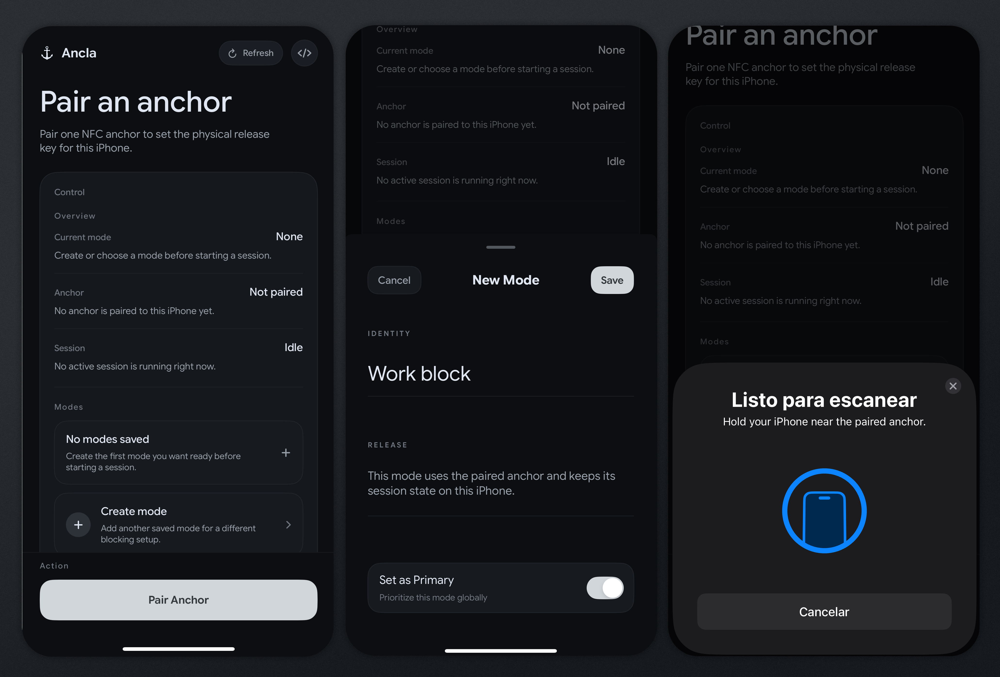

<p align="center">
  
</p>

<h1 align="center">ancla</h1>

<p align="center">
  <strong>an iphone app blocker built around one paired nfc anchor</strong>
</p>

<p align="center">
  
  
</p>

<p align="center">
  
</p>

---

`ancla` is a native iphone blocker that makes the release path physical. you pick the apps and sites you want blocked, pair one nfc anchor, arm a mode, and walk back to that same anchor when you want the block lifted.

## why

most blockers fail because the escape hatch is still living on the same piece of glass as the distraction. `ancla` moves that release path into the room instead. you pair one specific anchor, keep the state on the device, use the native apple surfaces where they matter, and force yourself to make a physical decision before the block goes away.

## how it works

1. grant screen time access on iphone
2. choose the apps and domains you want blocked
3. pair one physical nfc anchor
4. arm a mode
5. scan the paired anchor later to release it

wrong tags do not release the session. the point is to tie the exit path to one object in the room, not another tap in the app.

## what you need

- an iphone with nfc support
- one `ntag213` sticker

## sticker buying guide

buy `ntag213`. that is the clean default for `ancla`.

why this one:

- iphone compatibility is the main priority, not extra tag memory
- `ancla` only needs a reliable unique tag identifier for pairing and release
- larger round stickers are easier to scan on iphone than tiny tags
- `on-metal` only matters when you are mounting the sticker on metal

avoid these as the default:

- `mifare classic`
- tiny `10 x 10 mm` stickers
- `ntag215` or `ntag216` unless you have some other memory-heavy use case
- standard stickers on metal surfaces

recommended buys:

| marketplace | pick | notes |
| --- | --- | --- |
| [aliexpress](https://s.click.aliexpress.com/e/_c3De6uih) | `ntag213` round sticker, `38 mm` if available | best default buy for `ancla` |
| [aliexpress](https://s.click.aliexpress.com/e/_c3SMBZ1j) | `ntag213` round sticker, `25 mm` | smaller fallback if you want a cheaper pack |
| [aliexpress](https://s.click.aliexpress.com/e/_c3GSnHd7) | `ntag213` anti-metal tag | only if the sticker will live on metal |
| [amazon](https://www.amazon.com/Stickers-Adhesive-Compatible-NFC-Enabled-Smartphones/dp/B07GFHLZD1) | fongwah `ntag213` sticker pack | straightforward non-metal default |
| [amazon](https://www.amazon.com/Blank-White-Metal-NFC-Tag/dp/B01135KABO) | gotoTags on-metal `ntag213` | use only for metal mounting |


## installation

you will need to sideload the .ipa into your iphone:

1. download `ancla-*.ipa` from releases
2. sign the `.ipa` in Feather (or whatever app you decide to use)
3. install it on your iPhone

## repo layout

```text
ancla/
├── ios/      native iphone app, shared logic, shield extension, tests
├── site/     next.js site
├── docs/     sideloading notes and working prompts
└── brand/    canonical brand assets and visual direction
```

## license

MIT
