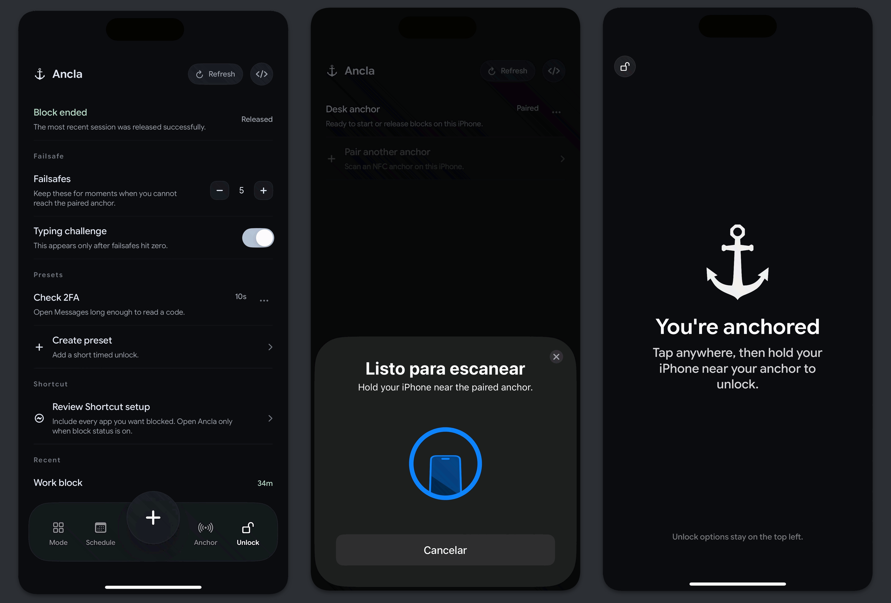

<p align="center">
  
</p>

<h1 align="center">ancla</h1>

<p align="center">
  <strong>a physical-release iphone blocker built around one paired nfc anchor</strong>
</p>

<p align="center">
  
  
  
</p>

<p align="center">
  
</p>

---

`ancla` is a sideload-first iphone blocker that makes the release path physical. you pair one nfc anchor, choose what should be blocked, and walk back to that same object when you want the session released.

the current product is intentionally narrow. it is not trying to be a generic productivity dashboard. it is a blocker with a physical exit path, a locked surface, shortcut-based redirecting on ios, unlock presets, and a fallback typing challenge.

## table of contents

- [what it does](#what-it-does)
- [how it works](#how-it-works)
- [current release path](#current-release-path)
- [what you need](#what-you-need)
- [sticker buying guide](#sticker-buying-guide)
- [install the app](#install-the-app)
- [architecture](#architecture)
- [repo layout](#repo-layout)
- [development](#development)
- [troubleshooting](#troubleshooting)
- [license](#license)

## what it does

- pairs one physical nfc anchor to the device
- stores block state on-device
- uses screen time protections plus a shortcuts automation flow on ios
- swaps the app into a locked surface while a block is active
- supports unlock presets for short temporary release windows
- supports a paragraph-accuracy failsafe challenge when the user enables it

## how it works

`ancla` uses apple's screen time api and ios shortcuts automation to enforce app and domain blocks. the block state lives entirely on-device — there is no cloud component or account system.

the physical release mechanism works through nfc tag scanning. during setup, you pair a single `ntag213` sticker to the app. when a block is active, the app presents a locked surface. tapping it arms the nfc reader. scanning the previously paired anchor releases the session. an optional paragraph-typing challenge is available as a failsafe when you cannot reach the physical anchor.

this is the honest current architecture. `ancla` relies on apple's screen time and shortcuts surfaces where needed instead of pretending it can silently take over the whole device.

## current release path

the current ios flow is:

1. choose the apps and domains you want blocked
2. create the ios shortcut automation shown in the setup flow
3. pair an nfc anchor
4. start a block from inside `ancla`
5. when blocked, tapping the locked surface arms nfc scanning
6. scan the paired anchor, or use an allowed failsafe path, to release

<p align="center">
  
</p>

## what you need

- an iphone with nfc support
- ios 17 or newer
- one `ntag213` sticker
- a sideloading path for the ipa

## sticker buying guide

buy `ntag213`. that is the clean default for `ancla`.

why this one:

- iphone compatibility matters more than extra tag memory
- `ancla` only needs a stable unique tag identifier
- larger round stickers are easier to scan than tiny tags
- on-metal tags only matter if the sticker will live on metal

recommended buys:

| marketplace | pick | notes |
| --- | --- | --- |
| [aliexpress](https://s.click.aliexpress.com/e/_c3De6uih) | `ntag213` round sticker, `38 mm` if available | best default buy for `ancla` |
| [aliexpress](https://s.click.aliexpress.com/e/_c3SMBZ1j) | `ntag213` round sticker, `25 mm` | smaller fallback |
| [aliexpress](https://s.click.aliexpress.com/e/_c3GSnHd7) | `ntag213` anti-metal tag | only for metal mounting |
| [amazon](https://www.amazon.com/Stickers-Adhesive-Compatible-NFC-Enabled-Smartphones/dp/B07GFHLZD1) | fongwah `ntag213` sticker pack | straightforward non-metal default |
| [amazon](https://www.amazon.com/Blank-White-Metal-NFC-Tag/dp/B01135KABO) | gotoTags on-metal `ntag213` | use only for metal mounting |

## install the app

the usual sideload path is:

1. download the latest unsigned `.ipa` from the release page
2. sign and install it with your own sideloading method
3. grant the required ios permissions
4. complete the shortcut setup inside the app
5. pair your anchor and start a block

`ancla` releases are published as unsigned artifacts only. this repo does not distribute ipa builds signed with the maintainer's certificate.

detailed sideloading instructions are in [docs/sideloading.md](docs/sideloading.md).

## architecture

```
┌──────────────────────────────────────────────────────┐
│                    ancla-app                         │
│  content-view · schedule-editor · lock-screen-view   │
│  app-view-model · ancla-theme · ancla-fonts         │
├──────────────────────────────────────────────────────┤
│                   ancla-shared                       │
│  ancla-core · ancla-models · ancla-store            │
│  ancla-services · ancla-dependencies                │
├──────────────────────────────────────────────────────┤
│               ancla-shield-extension                 │
│            screen-time enforcement layer             │
└──────────────────────────────────────────────────────┘
```

- **ancla-app** — swiftui interface layer. handles all user-facing views, theming, and view models.
- **ancla-shared** — core logic, data models, storage, and dependency injection. shared between the app and extensions.
- **ancla-shield-extension** — ios app extension that enforces screen-time based blocking.
- **ancla-core** (spm target) — a subset of shared logic published as a swift package, testable independently of the full app.

data flow: user action → view model → shared store (on-device) → shield extension enforcement. no network calls, no accounts, no cloud sync.

## repo layout

```text
ancla/
├── ios/      native iphone app, shared logic, shield extension, tests
├── site/     next.js marketing site
├── docs/     notes, verification docs, prompts
└── brand/    logos and brand assets
```

## development

ios app code lives under [ios](ios). the important targets are:

- `ios/ancla-app` for the main app
- `ios/ancla-shared` for shared models and storage
- `ios/ancla-shield-extension` for the shield extension
- `ios/ancla-core-tests` and `ios/ancla-tests` for test coverage

building requires xcode on macos. the project uses [xcodegen](https://github.com/yonaskolb/XcodeGen) — run `xcodegen generate` in the `ios/` directory to regenerate the `.xcodeproj` from `project.yml`.

core unit tests can also be run via the swift package manager:

```bash
cd ios
swift test  # runs AnclaCoreTests
```

## troubleshooting

**nfc scanning does not trigger:** hold the phone closer to the sticker. `ntag213` tags have a short read range (~1-2 cm). remove any thick case material between the phone and the tag. the nfc reader is near the top of the iphone on most models.

**tag not recognized after pairing:** make sure you are using the same physical sticker you paired during setup. `ancla` pairs exactly one tag — swapping stickers requires re-pairing.

**shortcuts automation not firing:** confirm the shortcut was created through the in-app setup flow. manual shortcut creation may miss required parameters. re-run the setup flow if the automation stops working after an ios update.

**sideloaded app loses permissions:** some sideloading methods revoke entitlements after the signing certificate expires. re-sign and reinstall the ipa with a valid certificate.

## license

this repository is source-available, not open source.

it is licensed under [PolyForm Strict 1.0.0](LICENSE).

required notices:

- copyright (c) 2026 Microck. all rights reserved.
- no trademark rights are granted for `Ancla`, `Microck`, or any related names, logos, or branding.

that means people can inspect and use the code for permitted noncommercial purposes, but they do not get rights to redistribute it, publish modified copies, ship it to app stores, or turn it into their own product.

separately from the license, no trademark rights are granted to the `ancla` name, logo, or related branding. for commercial or distribution rights, contact contact@micr.dev.
